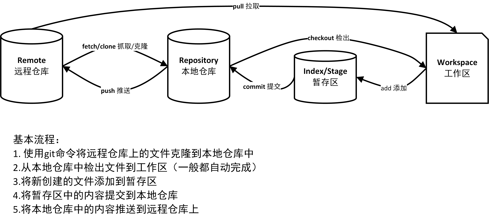

# Git 学习笔记

官方参考手册：https://git-scm.com/docs

## Git 基本工作流程

- 工作区 Workspace
- 暂存区 Index/Stage
- 本地仓库 Repository
- 远程仓库 Remote



## Setup and Config

### config

```bash
# 列举config中的所有变量集，包括它们的值
git config --list
--add  # 添加配置项
--unset  # 删除配置项

# 配置用户信息
git config --global user.name "your name"  # 配置用户名
git config --global user.email "your email"  # 配置用户邮箱

# 查询配置信息
git config --list  # 列出当前配置
git config --local --list  # 列出repository配置
git config --glocal --list  # 列出全局配置
git congig --system --list  # 列出系统配置
```

### help

显示帮助信息

```bash
git help name
```

## Getting and Creating Projects

### init

创建新的Git仓库

```bash
git init  # 创建一个新的本地仓库
```

### clone

拷贝一个远程仓库到本地

```bash
git clone URL  # 从远程git仓库复制项目
```

## Basic Snapshotting

### status

查看工作区状态，输出一般有三种状态：

- Changes to be committed: 已经在暂存区, 等待添加到HEAD中的文件
- Changes not staged for commit: 有修改, 但是没有被添加到暂存区的文件
- Untracked files: 没有tracked过的文件, 通常有两类，一类是工作区中从未git add过的文件，另一类是编译过的程序文件（.pyc，.obj，.exe等），这类文件可以放入.gitignore中、

常用指令：

```bash
git status  # 查看文件状态
git status -s  # 获得简短的输出结果，绿色表示已添加到暂存区，红色表示未添加到zan'cun区，M表示修改，D表示删除，??表示untracked
```

### diff

比较文件的不同，即比较文件在缓存区和工作区的差异

```bash
git diff  # 查看尚未缓存的改动
git diff --cached  # 比较暂存区和本地仓库最后一次提交的差异
git diff --staged  # 显示差异统计
git diff HEAD  # 自上次提交以来工作树的修改
```

### add

```bash
# 工作区——>暂存区
git add XXX  # 提交到暂存区
git add .  # 提交工作区所有文件到暂存区，会根据.gitignore做过滤
git add *  # *是shell的通配符，添加.开头外的所有文件，不会根据.gitignore做过滤（慎用）
git add filename  # 提交工作区中指定文件到暂存区
git add dirname  # 提交工作区中某个文件夹中所有文件到暂存区
```

### commit

```bash
# 暂存区——>本地仓库
git commit -m "message"  # 提交暂存区的文件到本地仓库
git commit -a -m "messgae"  # 跳过git add步骤直接提交到本地仓库，只对修改和删除的文件有效，新文件仍需git add，否则为untracked状态
git commit --amend  # 修改提交记录
```

### reset

回退版本，可以指定退回某一次提交的版本 

#### HEAD

当前分支的指针，总是指向该分支的最后一次提交，可以看做是上一次提交的快照


```bash
HEAD  # 表示当前版本
HEAD^  # 上一个版本
HEAD^^  # 上上一个版本
HEAD^^^  # 上上上一个版本
HEAD~0  # 表示当前版本
HEAD~1  # 上一个版本
HEAD~2  # 上上一个版本
HEAD^3  # 上上上一个版本
```

常用指令

```bash
git reset [--soft | --mixed | --hard] [HEAD]
--soft  # 回退到之前的版本，不会修改暂存区和工作区的内容，将重置HEAD带来的新差异放进暂存区
--mixed  # 默认，可以不用带该参数，重置暂存区文件与上一次的提交保持一致，工作区文件内容保持不变
--hard  # 撤销所有未提交的修改内容，将暂存区和工作区都回退到之前版本
```

### rm

删除文件

```bash
git rm <file>  # 将文件从工作区和暂存区中删除
git rm -f <file>  # 强制删除，如果文件删除之前修改过且已经add到暂存区则必须使用强制删除
git rm --cached <file>  # 将文件从暂存区移除，但仍保留在工作区
git rm -r *  # 递归删除，*表示目录
```

### mv

移动或重命名一个文件

```bash
git mv [file] [newfile]
git mv [source] [destination]
-f  # 强制重命名即使新文件名已存在
```

## Branching and Merging

### branch

用于列出、创建或删除分支

```bash
# 分支命令
git branch  # 查看所有分支，当前分支前会加星号
git branch 分支名  # 创建分支
git branch -r  # 显示远程分支
git branch -a  # 显示本地和远程分支
git branch -m [branch] [newbranch]  # 修改分支名
git branch -d [branch]  # 删除本地分支
git branch -d -r [branch]  # 删除远程分支
git branch -u origin/远程分支名  # 将本地分支与远程分支关联
git branch --set-upstream-to origin/远程分支名  # 同上
git branch --unset-upstream  # 撤销本地分支与远程分支
```

### merge

用于将两个或以上的开发历史合并到一起

```bash
git merge [branch]  # 将branch分支合并到当前分支上
git merge --abort  # merge发生冲突时使用，中止merge进程并重建到merge前的状态。注意合并开始时如果存在未commit的文件，该指令可能会失效。
```

```
example [git merge topic]: 
          A---B---C topic
         /
    D---E---F---G master
    
          A---B---C topic
         /         \
    D---E---F---G---H master
```

###  log

```bash
# 查看提交记录
git log
git log --oneline  # 每次提交记录以单行显示
```

### stash

将更改储存在脏工作目录中

应用场景：当在 dev 分支下开发新功能时，main 分支突然出现了问题，此时必须要切换到主分支紧急修复 Bug，此时就可以使用 git stash 指令暂存当前未提交的修改，这样工作区干净之后就可以切换到 main 分支下修复 Bug。在修复完成后，切换回 dev 分支下使用 git stash pop 命令将修改提取出来，继续进行新功能的开发工作即可。

默认情况下，git stash 会缓存下列文件：

- 添加到暂存区的修改（staged changes）
- Git跟踪的但并未添加到暂存区的修改（unstaged changes）

但不会缓存以下文件：

- 在工作目录中新的文件（untracked files）
- 被忽略的文件（ignored files）

```bash
git stash  # 暂存分支下未提交的修改，所有修改都保存至栈中
git stash save [message]  # 暂存时添加标识信息
git stash list  # 查看暂存的文件
# stash@{index}: WIP on [分支名]: [最近一次的commitID] [最近一次的提交信息]
git stash pop  # 恢复暂存之前的工作目录，删除stash list中的记录
git stash apply stash@{index}  # 恢复暂存之前的工作目录，不删除stash list中的记录，可以指定index
git stash drop stash@{index}  # 删除stash list中的记录，可以指定index
git stash clear  # 删除stash list中的所有记录
git stash show -p stash@{index}  # 查看指定index的记录信息，-p显示详细信息
```

### worktree

管理多个工作树

```bash
git worktree list [--porcelain]  # 列出每个工作树的详细信息,--porcelain可以改变显示风格
git worktree lock  # 锁定worktree防止其被移除
git worktree unlock  # 解除锁定
```

## Sharing and Updating Projects

### fetch

从远程分支拉取代码，不会自动合并

```bash
git fetch <远程主机名> <分支名>
# 取回更新的同时会返回一个FETCH_HEAD
# 可以用git log [-p] FETCH_HEAD查看拉取的代码和本地不同的地方
```

### pull

从远程仓库拉取代码并合并本地的版本

```bash
git pull <远程主机名> <远程分支名>:<本地分支名>
# git pull = git fetch + git merge FETCH_HEAD
```

### push

将本地分支的更新，推送到远程主机

```bash
git push <远程主机名> <本地分支名>:<远程分支名>
git push --force <远程主机名>  # 远程主机版本比本地版本更新，要求先在本地git pull合并差异，如果一定要推送，可以采用--force
```

### remote

管理远程仓库

```bash
git remote  # 列出已经存在的远程分支
git remote -v  # 列出详细信息
git remote show [remote]  # 显示某个远程仓库的信息
git remote add [shortname] [url]  # 添加远程版本库，shortname为版本库简称，url为版本库地址
git remote rm name  # 删除远程仓库
git remote rename old_name new_name  # 修改仓库名
git remote set-url <remote name> <newURL>  # 修改远程仓库的URL
```

## Patching

### rebase

变基，Reapply commits on top of another base tip


rebase常见用法：

1. 合并多个commit为一个完整commit


2. 将某一段提交粘贴到另一个分支上

   

3. 无特殊需求尽量用merge！


